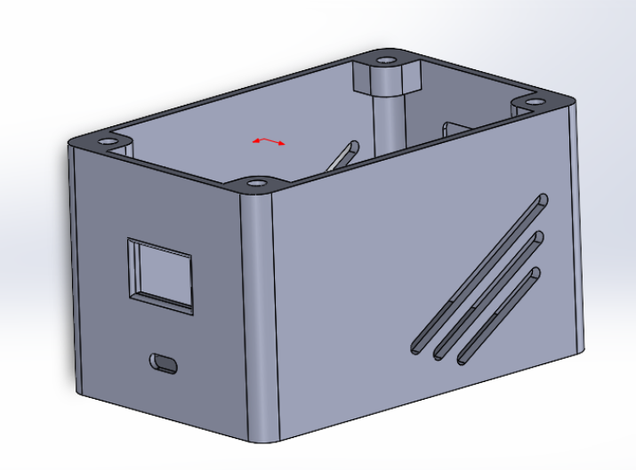
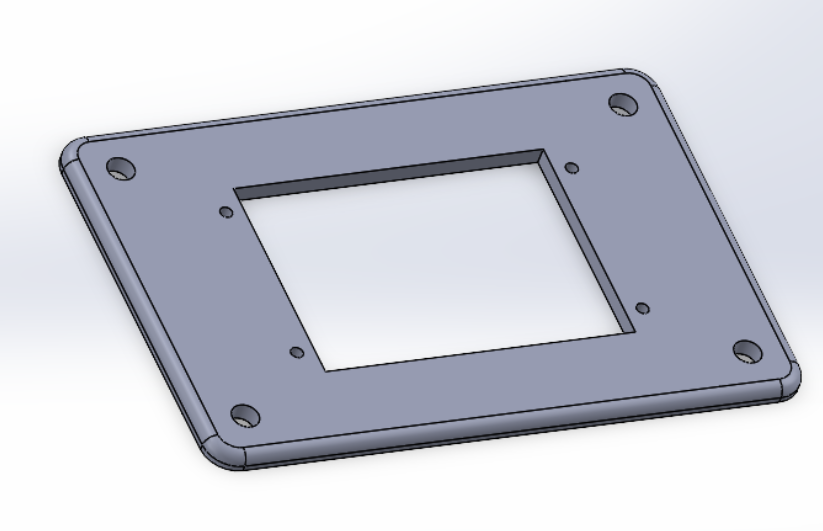
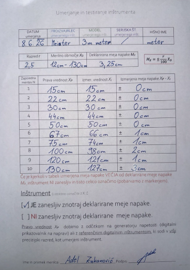

# MRE-PROJEKT-MERILNIK-RAZDALJE
Senzor deluje tako, da oddaja infrardeč laserski žarek, ki se odbije od predmeta in vrne nazaj. Glede na to, kako dolgo je žarek potoval, izračuna razdaljo. Arduino to vrednost prebere in jo pošlje na zaslon, kjer se izpiše v centimetrih. Da zaslon ne utripa, se osveži samo takrat, ko se 10-krat zmeri razdaljo in jo izpiše kot povprečno razdaljo.
Za električni del smo uporabili Arduino Nano, VL53L0X laserski senzor za razdaljo, TFT zaslon ST7789 (240x320), nekaj žičk in PCB ploščico za povezavo.Za strojni del smo uporabili plastično ohišje v katerem je vse skupaj nameščeno, ter vijake za pritrditev komponent.

Slika vezalne sheme (EasyEda):

Sliki ohišja:

videoposnetek delovanja:

Komentar in ocena natančnosti delovanja:

Merilnik deluje stabilno, zaslon se osveži brez utripanja. Ugotovili smo, da je pri razdaljah do ~1m natančnost ±1-2cm, pri večjih razdaljah pa so odstopanja večja. Opazili smo, da povprečenje 10 meritev vidno zmanjša šum.

Predlagane izboljšave, postopek kalibracije senzorja:

Za kalibracijo smo primerjali izmerjene vrednosti z referenčnim merilom na razdaljah 10cm, 50cm in 100cm ter po potrebi dodali offset v kodi. Kot možne izboljšave predlagamo zvočni signal pri določeni razdalji, shranjevanje meritev na SD kartico ali nastavitev enot (cm/mm) z gumbom, merjenje razdalje v decimalkih.
