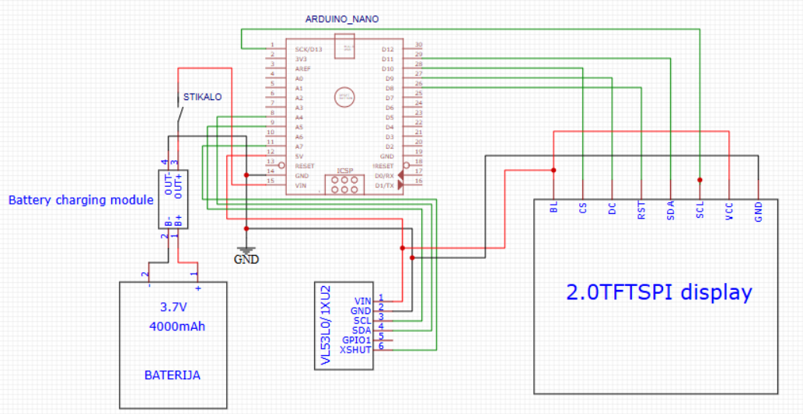
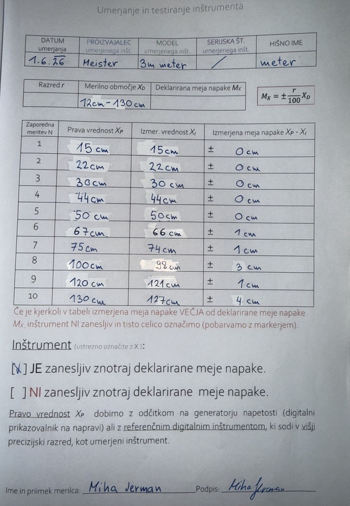

# MRE-PROJEKT-MERILNIK-RAZDALJE
Senzor deluje tako, da oddaja infrardeč laserski žarek, ki se odbije od predmeta in vrne nazaj. Glede na to, kako dolgo je žarek potoval, izračuna razdaljo. Arduino to vrednost prebere in jo pošlje na zaslon, kjer se izpiše v centimetrih. Da zaslon ne utripa, se osveži samo takrat, ko se 10-krat zmeri razdaljo in jo izpiše kot povprečno razdaljo.
Za električni del smo uporabili Arduino Nano, VL53L0X laserski senzor za razdaljo, TFT zaslon ST7789 (240x320), nekaj žičk in PCB ploščico za povezavo.Za strojni del smo uporabili plastično ohišje v katerem je vse skupaj nameščeno, ter vijake za pritrditev komponent.

slike načrtov za ohišje

videoposnetek delovanja

 Komentar na delovanje in ocena natančnosti delovanja

 predlagane izboljšave, postopek kalibracije senzorja itd. vnesite še na koncu datoteke README.md
